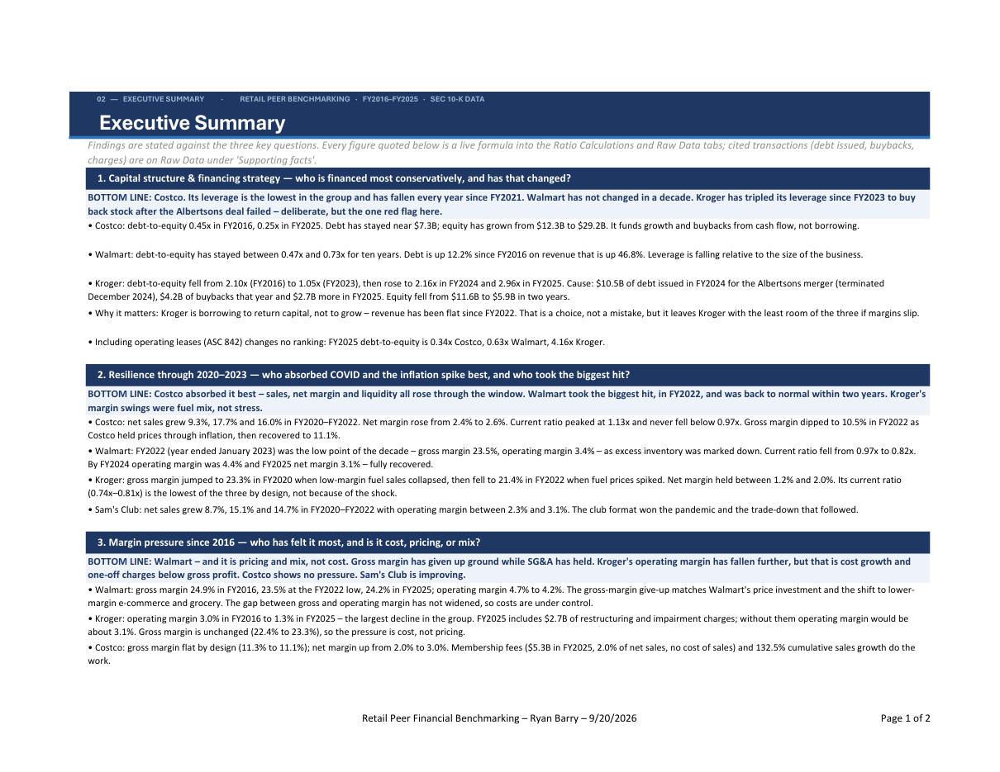
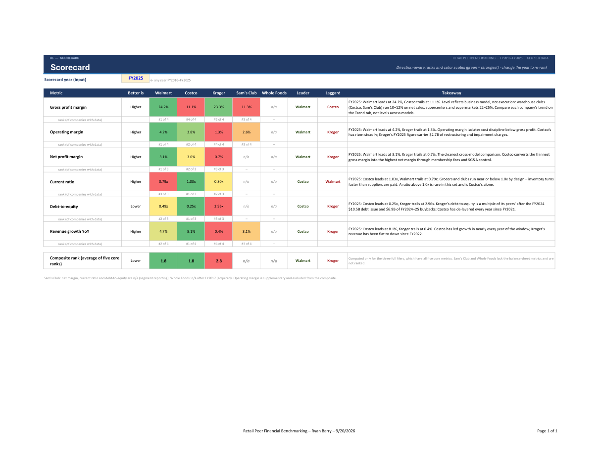

# Retail Peer Financial Benchmarking: Walmart, Costco, Kroger & Sam's Club

**A personal portfolio project by Ryan Barry.** Built from public SEC filings
only; not an H-E-B work product and no non-public information used.

**Deliverable:** [`output/Retail_Peer_Benchmarking.xlsx`](output/Retail_Peer_Benchmarking.xlsx)
– 8 tabs, 948 live formulas, 103 named ranges, 0 formula errors after a full
recalculation in Excel. Every analytical number is a formula; every input
carries its XBRL tag, accession number and filing date.

## The three questions – and the answers

| Question | Bottom line |
|---|---|
| **1. Capital structure** – who is financed most conservatively, and has that changed? | **Costco**, and increasingly so: debt-to-equity 0.45x (FY2016) → 0.25x (FY2025). Walmart is unchanged (0.47x–0.73x band). **Kroger is the red flag**: 1.05x (FY2023) → 2.96x (FY2025) after a $10.5B debt issue for the terminated Albertsons merger and $6.9B of buybacks on a shrinking equity base. |
| **2. Resilience 2020–2023** – who absorbed COVID and inflation best? | **Costco** – revenue +9%/+18%/+16%, net margin up, current ratio peaked at 1.13x. **Walmart took the biggest hit** (FY2022 gross margin 23.5%, operating margin 3.4% – decade lows) but recovered within two years. Kroger's swings were fuel-mix, not stress. |
| **3. Margin pressure** – who has felt it most; cost, pricing or mix? | **Walmart**, and it is pricing and mix: gross margin 24.9% → 24.2% while SG&A held. Kroger's operating-margin drop (3.0% → 1.3%) is cost and $2.7B of FY2025 charges, not pricing. Costco: none. |

## Preview

Don't want to open Excel? The reader's copy is
[`docs/Retail_Peer_Benchmarking_summary.pdf`](docs/Retail_Peer_Benchmarking_summary.pdf) (Cover, Executive
Summary, Scorecard, Trend – 7 pages).

**Executive Summary** – one bold verdict per question, then the evidence; every number is a live formula.



**Scorecard** – direction-aware ranks and color scales; type any year into B3 and it re-ranks.



**Trend** – six native Excel charts with the FY2020–FY2023 shock window shaded.


## Workbook tabs

| Tab | What it does |
|---|---|
| Cover | Title page, coverage, contents with links |
| Executive Summary | Bottom line + evidence bullets per question; numbers in the prose are formulas |
| Raw Data | As-reported inputs (blue), Total-debt build by formula, memo lines, supporting facts – one named range per block |
| Ratio Calculations | `=IFERROR(XLOOKUP(year, Years, Company_Metric)…, "n/a")` for six ratios, with Δ FY16→25 and Δ FY19→23 columns |
| Scorecard | Year-selectable (data-validated input) ranking with RANK.EQ, INDEX/MATCH leader/laggard, color scales, live takeaway text, composite rank |
| Trend | Six native combo charts; FY2020–FY2023 shaded via a secondary-axis column series; NA() helper block for gaps |
| Methodology & Tools | Sources, techniques, ASC 606 / 842 / 280 / LIFO comparability, assumptions, limits |
| Data Lineage | 647 rows: value, tag, dimension, accession, filed, restated flag, first-filed value, EDGAR link |

## Skills demonstrated

- **SEC EDGAR / XBRL extraction** – companyfacts API for undimensioned facts; XBRL instance
  parsing (lxml) for dimensional segment facts and for values the API omits; latest-filed
  (restated) value with first-filed value retained; SEC fair-access throttling and a download manifest.
- **GAAP / ASC application** – ASC 606 tag drift handled by per-company tag priority lists;
  ASC 842 written Total-debt policy (finance leases in, operating leases out, memo line shown);
  ASC 280 / ASU 2023-07 segment disclosures for Sam's Club (which is why its cost of revenue
  exists only from FY2022); LIFO vs FIFO comparability with Kroger's disclosed reserve.
- **Excel automation** – the whole workbook is generated by `src/build_workbook.py` (openpyxl),
  then recalculated and error-scanned in Excel through COM (`src/recalc_excel.py`), which also
  finishes the combo charts. Re-running three scripts rebuilds it from EDGAR end to end.
- **YAML configuration** – `config/companies.yaml` (CIKs, fiscal-year rules, tag lists,
  inventory methods) and `config/debt_policy.yaml` (per-company debt build) hold every
  judgment that is not code.
- **Verification** – 18 pytest checks: extraction coverage, accounting identities, derivation
  tie-outs, segment sanity, and workbook values tied back to an independent pandas computation.

## Data coverage

| Company | Coverage |
|---|---|
| Walmart, Costco, Kroger | All seven inputs, FY2015 (growth base) – FY2025, from standalone 10-Ks. Costco revenue is **net sales** (membership fees shown as a memo line) so its basis matches Walmart's and Sam's Club's net sales |
| Sam's Club | Walmart reportable segment: net sales, operating income, total assets FY2015–FY2025; cost of revenue FY2022–FY2025 |
| Whole Foods | Standalone 10-Ks FY2015–FY2017; Amazon "Physical stores" net sales FY2018–FY2025 as a labeled successor line |

Missing data is shown as `n/a`, never estimated. Seven values the API could not
return were read from the filing's XBRL instance or derived from two tagged facts;
each is cited in `data/overrides.csv` and shaded yellow in the workbook.

## Audit

`docs/audit_report.md` records a full audit of the finished workbook: every core input re-verified
against the SEC frames API (187/187) and against 30 parsed 10-K XBRL instance documents (484/493,
the 9 differences all being restatements where the sheet correctly uses the latest-filed value);
360/360 ratio formulas checked against their definitions; ranks, color scales, chart ranges and
Executive Summary claims tied to the data; inventory-policy statements checked against 10-K text.
Two findings were fixed as a result (Costco revenue basis; Walmart FY2018 capital leases).

## Build

The SEC requires every EDGAR request to identify the requester
([fair-access policy](https://www.sec.gov/os/accessing-edgar-data)). Copy `.env.example` to
`.env` and set `SEC_USER_AGENT` to **your own** name and email; `.env` is git-ignored and is
never committed.

```
python -m venv .venv
.venv\Scripts\python -m pip install -r requirements.txt
copy .env.example .env
.venv\Scripts\python -m src.pull_data
.venv\Scripts\python -m src.pull_segments
.venv\Scripts\python -m src.build_workbook
.venv\Scripts\python -m src.recalc_excel output\Retail_Peer_Benchmarking.xlsx
.venv\Scripts\python -m src.export_docs      # reader PDF + README images
.venv\Scripts\python -m pytest -q
```

## Repository layout

```
config/    companies.yaml, debt_policy.yaml
data/      facts_long.csv, segments_long.csv, overrides.csv, driver_facts.csv (raw/ is cached EDGAR, git-ignored)
src/       edgar.py, pull_data.py, pull_segments.py, build_workbook.py, recalc_excel.py, export_docs.py, audit_raw.py, audit_instances.py
tests/     test_data.py, test_workbook.py
output/    Retail_Peer_Benchmarking.xlsx
docs/      audit_report.md, Retail_Peer_Benchmarking_summary.pdf, page images used above
```
